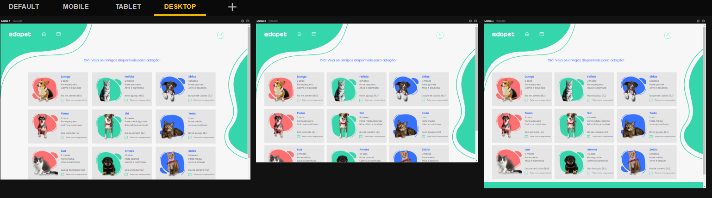

<h1 align='center'>ADOPET</h1>

   

> Status do Projeto: :warning: em desenvolvimento.

## Descrição do projeto

    Projeto com intuito de reforçar o aprendizado em CSS3.

## Layout ou Deploy da Aplicação :dash:

Tela mobile da tela de login (ainda não responsiva para desktop e tablet)

Tela mobile da página de início (não está responsiva para desktop)

Tela de tablet da página de início

Tela com a lista de bichinhos responsiva em todos os dispositivos

Tela mobile

Tela tablet

Tela desktop

Tela de contato responsiva para todos os dispositivos

Tela de contato para mobile

Tela de contato para tablet

Tela de contato para desktop

Tela de cadastro (responsiva somente para mobile)

- Frontend Mentor - [@natsmarinho](https://www.frontendmentor.io/profile/natsmarinho)
- Twitter - [@natsmarinho](https://www.twitter.com/natsmarinho)
- Instagram - [@natsmarinho](https://www.instagram.com/natsmarinho/)
